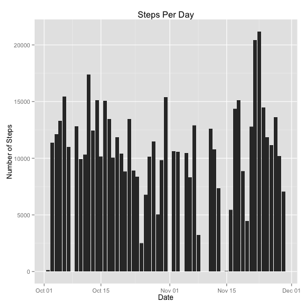
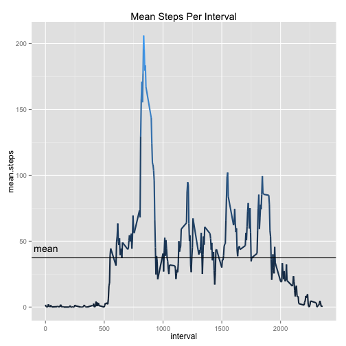
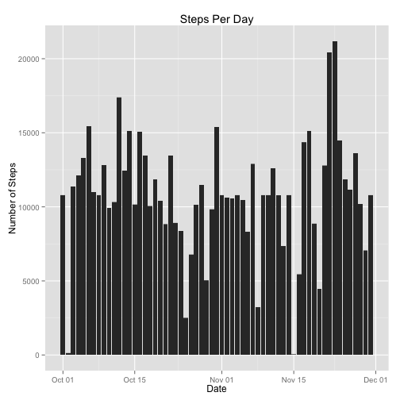
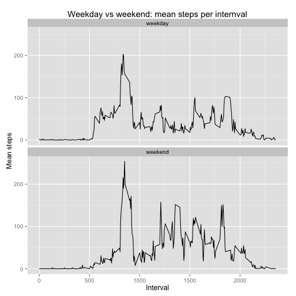

# Analysis and process
## Data and packages
Download the raw [activity monitoring data](https://d396qusza40orc.cloudfront.net/repdata%2Fdata%2Factivity.zip) and place file in your working directory. 

Load the following packages. If packages have not been installed, you will need to install them at this point using install.packages(). 

```r
library('lubridate')
library('ggplot2')
library('dplyr')
library('knitr')
library('markdown')
```


Load data with the following code. Change 'date' column to class 'date'. 


```r
data <- read.csv('activity.csv')
data$date <- as.POSIXct(data$date)
```


## Steps per day analysis
Let's see what the distribution of steps per day looks like using a histogram.

```r
plot1 <- ggplot(data, aes(x = date, y = steps)) +
    geom_histogram(stat = 'identity') + 
    labs(title = "Steps Per Day", x = 'Date', y = 'Number of Steps') +  
    scale_x_datetime()

plot1
```

 

To calculate the mean and median steps per day, the data must be transformed. 


```r
tot.steps.day <- data %>%
    group_by(date) %>%
    summarise(tot.steps = sum(steps))
```


```r
mean.steps.day <- mean(tot.steps.day$tot.steps, na.rm = TRUE)
median.steps.day <- median(tot.steps.day$tot.steps, na.rm = TRUE)
```

The **mean** steps per day is **10766.2**.

The **median** steps per day is **10765**.


## Average daily pattern analysis
In order to plot the average number of steps taken taken per day, averaged across all days, the data must be transformed.


```r
int.mean <- data %>%
    group_by(interval) %>%
    summarise(mean.steps = mean(steps, na.rm = TRUE))
```

Now data is ready to be plotted with ggplot.

```r
plot2 <- ggplot(int.mean, aes(x = interval, y = mean.steps)) +
    theme(legend.position = 'none') + 
    geom_line(aes(color = mean.steps), size = 1) + 
    geom_hline(aes(yintercept = mean(int.mean$mean.steps))) + 
    annotate('text', x = 4, y = 45, label = 'mean') +
    labs(title = 'Mean Steps Per Interval')

plot2
```

 


```r
max.int.steps <- filter(int.mean, mean.steps == max(mean.steps))
```
The interval with the maximum average steps per day is **835** with **206** steps.


## Dealing with missing values and imputation

```r
inc.cases <- sum(!complete.cases(data))
```
There are **2304 missing values** indicated as NA in the data set. To compare the possible differences in analysis between the data set with missing values and a data set that contains no missing values, we impute the missing values.

The code below matches the interval containing NAs and imputes the average steps taken for said interval from the entire data set.

```r
data3 <- data
data3 <- left_join(data3, int.mean, by = 'interval')
data3$steps[which(is.na(data3$steps))] <- data3$mean.steps[is.na(data3$steps)]
```
After imputation, a new complete data set is ready to be ploted.

```r
plot4 <- ggplot(data3, aes(x = date, y = steps)) +
    geom_histogram(stat = 'identity') + 
    labs(title = "Steps Per Day", x = 'Date', y = 'Number of Steps') + 
    scale_x_datetime()

plot4
```

 

Now, let's compared the difference of both mean and median between the incomplete data set and the new data set with imputed values.

```r
tot.steps.day.data3 <- data3 %>%
    group_by(date) %>%
    summarise(tot.steps = sum(steps))

imp.mean <- mean(tot.steps.day.data3$tot.steps)
imp.median <-median(tot.steps.day.data3$tot.steps)

data.steps.sum <- sum(data$steps, na.rm = TRUE)
data3.steps.sum <- sum(data3$steps)
```
The new **mean** is **10766.2**.

The new **median** is **10766.2**.

There is not a huge difference compared to mean and median calculations of the original data set. One possible reason for this could be the imputation method used. 

## Weekend vs weekday activity analysis
To analyze the difference in activity between weekdays and weekends, the data must be transformed once again. A new factor variable will be added with two levels; 'weekend' and'weekday.'

```r
data4 <- data3
data4$wday <- wday(data4$date)
data4$week.cat <- NA
data4$week.cat[which(data4$wday > 5)] <- 'weekend'
data4$week.cat[is.na(data4$week.cat)] <- 'weekday'
data4$week.cat <- as.factor(data4$week.cat)

int.data4 <- data4 %>%
    group_by(week.cat, interval) %>%
    summarise(mean.steps = mean(steps))
```
Now we can plot the differences between weekend and weekday activity.

```r
plot5 <- ggplot(int.data4, aes(x = interval, y = mean.steps, group = week.cat)) +
    geom_line() + facet_wrap(~week.cat, ncol = 1) + 
    labs(title = 'Weekday vs weekend: mean steps per internval', x = 'Interval', y = 'Mean steps')

plot5
```

 


This visualization shows that the weekday segment is more active in the earlier parts of the day. The weekend segment appears to be slightly more active throughout the entire day however.
